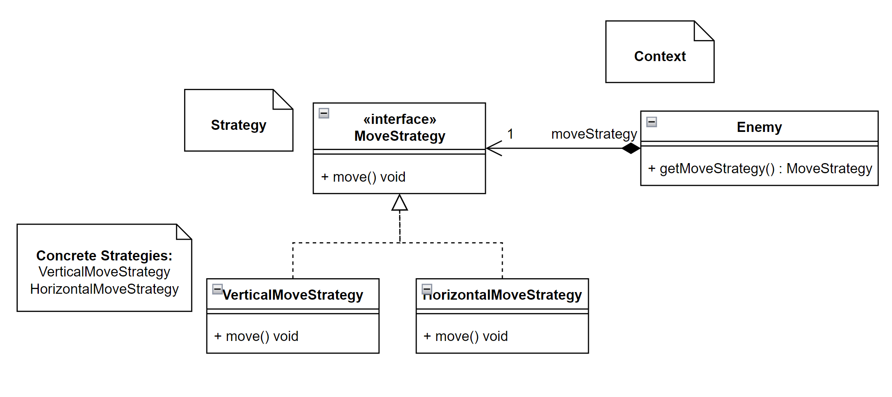
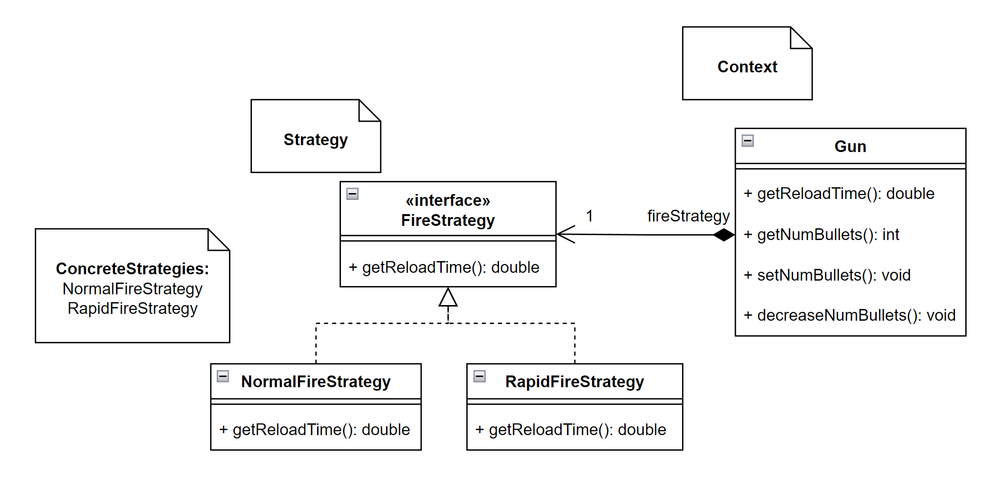

## LDTS_0606 - Shell Shift

Shell Shift is an endless platformer where the player tries to survive for the longest time by dodging or killing enemies or by avoiding falling outside the map borders. Collect coins along the way to enhance Chell's strength and upgrade her weaponry through the in-game Shop.

After navigating the dangerous Aperture Science facility, Chell stumbles upon a mysterious portal that transports her not to another testing chamber, but to an unfamiliar and surreal realm – the Linux Shell. Now your mission is to get Chell through the unstable Shell and all its unique bugs. Gather coins and eliminate every bug you encounter, all while maintaining a careful balance and ensuring Chell doesn't succumb to the lethal consequences of the Shell's coding abyss.

This project is developed by *António Santos* (*up202205469@up.pt*), *Vanessa Queirós* (*up202207919@up.pt*) and *Vasco Costa* (*up202109923@up.pt*) for LDTS 23/24.

### IMPLEMENTED FEATURES

- **Main Menu** - When the game starts, a player will be prompted with options to the different menus available as well as starting a game or exiting the application. [Current Main Menu implemented](CurrentMainMenu.png)
- **Movement** - Chell is free to move in every direction and to jump platform to platform.
- **Shooting** - Chell carries a gun that can be shot using the space bar. 
- **Platforms** - Platforms appear throughout the game in (semi-)random positions. Chell is guaranteed to always have a platform in her way, but watch out for the monsters...
- **Monsters** - As the player navigates through the endless platforms, several monsters will challenge Chell's journey. Currently, there are two types of monsters with different HP and random moving strategies: Soft/Orange and Hard/Blue monsters. 
- **Monsters movement** - Monsters are able to move with a *MoveStrategy*. Two strategies are implemented: *HorizontalMoveStrategy* and *VerticalMoveStrategy*.
- **Coins** - Coins will appear on the platforms and can be collected by Chell to spend later on the shop.
- **Powerups** - Powerups will appear on the platforms and can be collected by Chell. There are three different types implemented:
  - Star: increased speed and invincibility for 10 seconds;
  - Speed: increased speed for 10 seconds;
  - Bullet: increase the number of available bullets.
- **Score Counter** - Chell gains points for every coin collected (+10 points), monster defeated (up to +50 points), and second survived.
- **HUD** - The *Score Counter* integrates a simple HUD with:
  - *Lives*: each life Chell has, is displayed with a small heart icon on the top right.
  - *Bullet Counter*: a counter of the number of bullets available is displayed on the bottom right of the screen.
  - *Active Powerups*: if Chell is under the effects of a powerup, such as a *Star*, a small representative icon will be displayed on the bottom centre of the screen.
  - *Coins Counter*: a counter of the number of coins obtained in the current playthrough is displayed on the bottom left of the screen.
- **Screen Borders** - If Chell either falls off a platform or leaves the screen's left border, she will die.
- **Chell-Monsters Collisions** - If Chell collides with a monster, she will be hurt and the monster will die. She will also be invincible for a small period.
- **Bullet-Monsters Collisions** - After shooting a bullet, if it collides with a monster, the monster will 25 health points.
- **Shop** - Using the coins collected, the player is able to buy different upgrades:
  - Rapid Fire: decreased gun reload time;
  - Extra life: 1 more starting life (up to 8 lives);
  - More Bullets: 10 more starting bullets (up to 200).
- **Tutorial** - Play the tutorial to learn how to play *Shell Shift*, learn the inputs, how to collect coins, kill monsters and take a look at the HUD (bullet counter, lives, coins counter).
- **Player Statistics** - A player can check Chell's statistics such as top 3 scores, coins collected, monsters killed and starting lives.
- **Options** - In the options submenu, a player can change the sound's volume or even turn the sound off.

### PLANNED FEATURES    

- **Bullet Damage Multiplier** - A player will be able to buy a bullet damage increase.
- **"AI" Monsters** - Monsters will be able to follow Chell's movement as well as throw projectiles in her way.

#### Mockups:
- [Main Menu](MainMenuMockUp.jpg)
- [Gameplay](InGameMockUp.jpg)
- [Shop](ShopMockUp.jpg)
- [Player Statistics](StatisticsMockUp.jpg)

# Model-View-Controller Pattern

In the initial design of our game, there was a lack of clear separation between the user interface, game logic, and data. This made it challenging to maintain and extend the codebase, while maintaining code readibility. 

MVC separates the application into three interconnected components:

1. **Model (Data):** Represents the game data, including Chell (with lives and a gun), the gun (with bullets and a `FireStrategy`), different enemies, platforms, coins, and bullets (with an associated `damageMultiplier`). The model encapsulates the game's data and logic, managing the state of the game and interactions between different elements.
2. **View (User Interface):** Manages the presentation of the game and its various menus to the player. This includes rendering Chell, enemies, platforms, coins, and other visual elements. The view interacts with the model to obtain necessary data for display.
3. **Controller (User Input):** Handles user input and translates it into actions that the model and view can understand. This involves managing player movements and interactions between different game elements, such as collisions. The controller communicates with the model to update the game state based on user input.

- [Models Implementation](https://github.com/FEUP-LDTS-2023/project-l06gr06/tree/bb562b88bc7733ae005f4d3ad7aadc0dbc0a4ef2/src/main/java/com/l06g06/shellshift/model)
- [Viewers Implementation](https://github.com/FEUP-LDTS-2023/project-l06gr06/tree/bb562b88bc7733ae005f4d3ad7aadc0dbc0a4ef2/src/main/java/com/l06g06/shellshift/viewer)
- [Controllers Implementation](https://github.com/FEUP-LDTS-2023/project-l06gr06/tree/bb562b88bc7733ae005f4d3ad7aadc0dbc0a4ef2/src/main/java/com/l06g06/shellshift/controller)

# State Pattern

While designing the UML we noticed that our game would have issues transitioning from menu to menu and from menu to the actual game. We noticed these issues because we had planned to use if conditions to determine if a certain condition was met. 

This meant that the game would start with a menu loop which would interact with the controller for the menu. Depending on the user choice (let's assume that it decides to start the game) the loop would now stop and a new loop (the actual game) would be started.

But then we realized that this would be very inefficient as every state (when Chell dies, when the player decides to go to the shop or when the player decides to see the rankings) would not only require if conditions inside the aforementioned loops but would require new loops and possibly goto statements.

So to solve this issue we decided to implement the State Pattern. This allows for the concrete state and it's controller to decide what to do next (controller is the transition). Also the loops would be a lot more simpler as each state would have a single instruction `step` which allows us to recive a `KeyPress`, execute a call to the concrete controller to process the `KeyPress` and a call to the concrete viewer to draw the GUI. 

This way Game would only require a single loop ( containing `step` ) and we would also not have to worry about other if conditions, loops or goto statements as these are handled by the respective state.

# Strategy Pattern

Soon in the development process, we decided that having multiple types of enemies/monsters aswell as different types of guns, would make the gameplay more interesting and engaging. 

To achieve this we decided to implement two different Strategy Pattern:
- **EnemyStrategy**: This interface defines a method `move()`  used by two different moving strategies for enemies, `VerticalEnemyStrategy` blocking movement on the x axis and `HorizontalEnemyStrategy` blocking movement on the y axis.

- **FireStrategy**: Chell's gun has a different firing strategy allowing not only to diversify the shooting mechanics but also to simplify the process of adding new mechanics in the future. Every class that implements `FireStrategy`has a `fire()` method that will make the bullets behave in different ways. For example, `SpreeFireStrategy`, will make the gun similar to a shotgun, with 3 bullets shot at the same time with different angles.

# Adapter Pattern
Although we are only using Lanterna on our game, there could be an instance where it would be interesting to use a different library to handle the graphical parts of the Game.
To achieve this goal, we have an interface `GUI` with the methods that we have found relevant to process graphics in our game, such as `drawText` or `drawChell`, that are implemented using Lanterna in `LanternaGui` and used by `Viewer<T>`.

- [GUI Wrapper implementation](https://github.com/FEUP-LDTS-2023/project-l06gr06/tree/bb562b88bc7733ae005f4d3ad7aadc0dbc0a4ef2/src/main/java/com/l06g06/shellshift/gui)

---

### SELF-EVALUATION

- António Santos: 33%
- Vanessa Queirós: 33%
- Vasco Costa: 33%